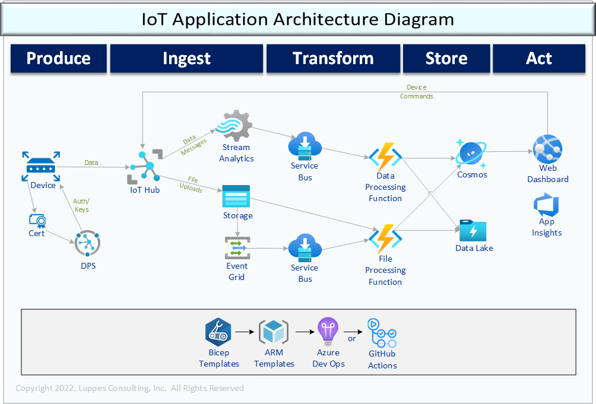

# Introduction

This is a working example of deploying an IoT Application using Azure IoT PaaS components (not IoT Central).
This project has Bicep deploys for all sorts of objects that coordinate with each other to form this application.

## Work In Process

### Add Device Connection Monitoring Demo

- (done) Create Service bus queue - connectionEvents
- (done) Change IotHub to have managed identity
- (failing) Add Event Grid subscription for connect/disconnect connectionEvents
- (not started) Update function app to read events and post to CreateDevOpsEnvironments
- (not started) Update web app to display these connect/disconnect events

## Getting Started

### 1. Before Deploy

1.1. Create AzDo environments listed in DeployToAzure/Environments folder. The YAML files are created with a DEV and QA environment, but that can easily be extended that to how ever many environments are needed.  

See also:

- [Create Azure DevOps Service Connections](./Docs/CreateServiceConnections.md)
- [Create Azure DevOps Environments](./Docs/CreateDevOpsEnvironments.md)

1.2. Create variable groups as shown in DeployToAzure/VariableGroups and fill in with appropriate data (i.e. subscription info, desired app name, etc.). The Bicep files are designed to use a three character* OrgCode (or user initials), and a six character Application Name, forming standardized and unique names for each environment.

    *Longer names can be specified, but some objects might have their names chopped off!

See also:

- [Create Azure DevOps Variable Groups](./.infrastructure/YML/readme.md)

---

### 2. Deploy Azure Resources

2.1. Create an Azure Dev Ops job to run the deploy_infra.yml YAML file to create the resources and execute the job, granting permissions as needed to the target subscription.

See also:

- [Create Azure DevOps Pipeline(s)](./Docs/CreateNewPipeline.md)

2.2 Event Grid:  If you have not enabled or used Event Grid in your subscription before, you may get an error message: "*The subscription is not registered to use namespace 'Microsoft.EventGrid'*".  In that case, you will have to enable Event Grid via a CLI command and try the deploy pipeline again:

    az provider register --namespace Microsoft.EventGrid

---

### 3. Post-Deploy

3.1. Create/purchase a root certificate for use in DPS and have the ability to create a leaf certificates for devices

3.2. Add the certificate that was obtained to the DPS certificate store

3.3. Create a DPS enrollment group based on the certificate.

    Note: these steps are still not available in ARM templates... maybe could do it in Powershell...? The certificate can be deployed in Bicep with auto-verification, but when the Bicep is run a second time it fails.

---

### 4. Deploy Applications

4.1. Deploy the Function App by creating a pipeline based on the deploy-function-only.yml.

See also: [Create Azure DevOps Pipeline(s)](./Docs/CreateNewPipeline.md)

4.2. Deploy the Dashboard Website by creating a pipeline based on deploy-webSite-only.yml.

4.3. Start the Function App, Website, and Stream Analytics

---

### 5. Start running the simulation

5.1. Build a Simulator EXE by creating a pipeline based on deploy-simulator-only.yml. That pipeline will create an artifact and optionally save it out to a storage folder

5.2. If using certificate authentication with the DPS, the DPS scope id will have to be updated in the config file.

5.3. Use the Simulator to stream data to the IoT Hub!
